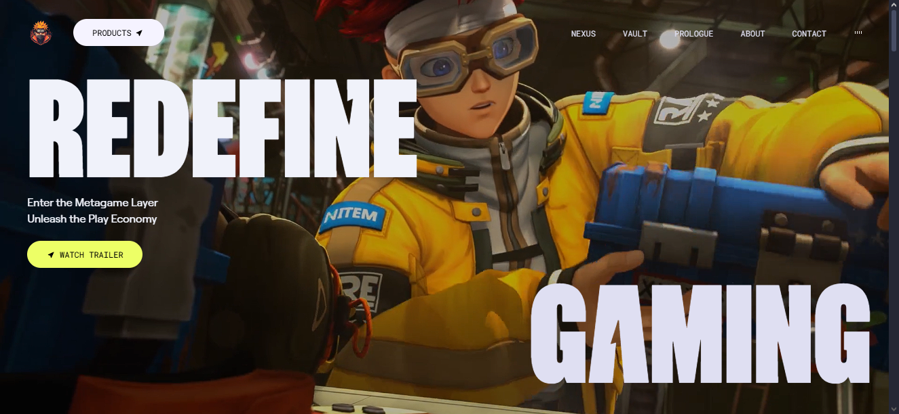
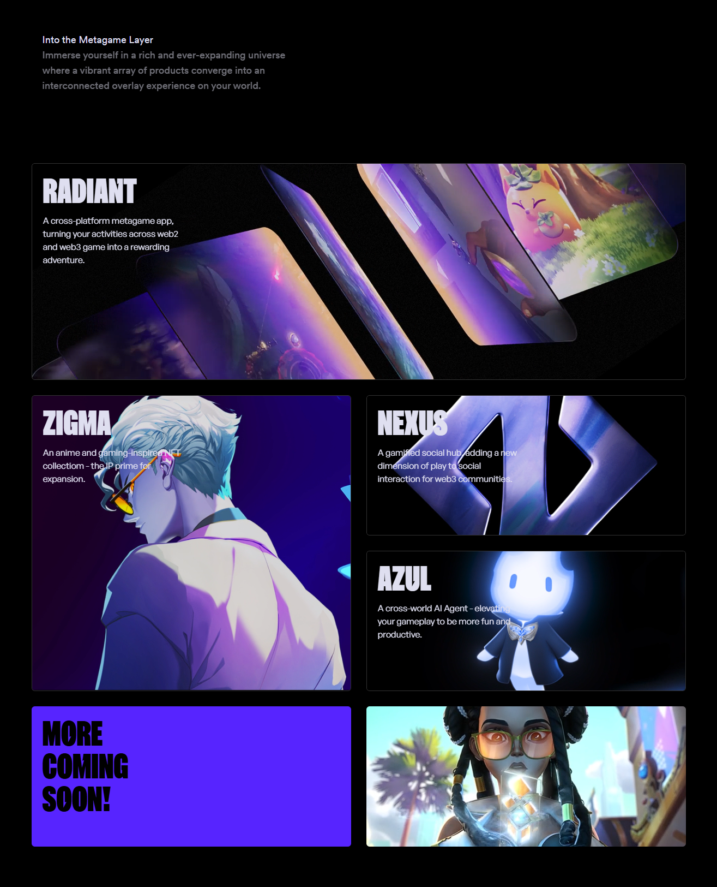
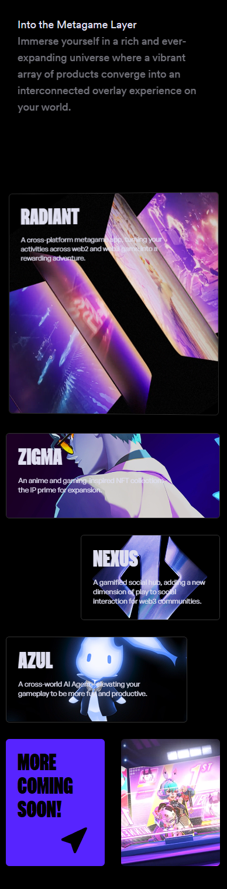

# 🎮 metaGame

A futuristic, animated web interface simulating the official page of an upcoming video game. Built with **React**, **Vite**, **Tailwind CSS**, and **GSAP**, this project focuses on delivering an immersive user experience through smooth animations, responsive layouts, and a modern component architecture.

🔗 **Live Demo:** [https://metagame-6e9e1.web.app](https://metagame-6e9e1.web.app/)

---

## 🌟 Why This Project Matters

**metaGame** isn't just a visual showcase — it's a professional-grade simulation of a real product website. It demonstrates how to build a performant, engaging and scalable frontend application using modern technologies and animation libraries. The project is ideal for demonstrating advanced React use, UI/UX thinking, and frontend craftsmanship.

---

## 🎯 Real-World Value

Game studios and entertainment brands often need launch websites that create hype, immersion, and seamless storytelling. metaGame offers:

- 💡 **High-impact presentation** — animated entry points, motion-based reveals, and interactive titles create visual depth.
- 🎮 **Scalable structure** — React component-based architecture makes it easy to extend with real data or features.
- ✨ **Polished animation** — GSAP integration ensures buttery-smooth transitions and attention-grabbing effects.
- 📱 **Responsive experience** — Tailwind CSS delivers consistent, mobile-friendly layouts.
- 🚀 **Fast performance** — built with Vite for lightning-fast development and deploy times.

---

## 🚀 Tech Stack

- **Frontend Framework:** React + Vite  
- **Styling:** Tailwind CSS  
- **Animations:** GSAP (GreenSock Animation Platform)  
- **Icons:** React Icons  
- **Deployment:** Firebase Hosting *(used only for static deployment)*

---

## 🔑 Features & Components

- 🎥 **Hero Section:** GSAP-animated headline, subtext, and action prompt.
- 🧭 **Navbar:** Sticky navigation with scroll-to-section behavior.
- 📦 **Section Components:** Custom reusable components like `About`, `Story`, `Features`, `Contact`, etc.
- 🌀 **Animated Titles:** GSAP-powered effects to animate section headers.
- 📱 **Responsive Layout:** Fully mobile-compatible with clean breakpoints via Tailwind.
- 🖼️ **Image/Video Previews:** Visual content components that simulate game teasers.
- 🎯 **Modular Code Structure:** All UI pieces live inside `src/components` for clean maintainability.

---

## 📸 Screenshots

  
*Hero view with animated title and call-to-action*

  
*Scroll-triggered section transitions*

  
*Fully responsive layout on mobile*

---

## 📦 Installation & Development

`git clone https://github.com/Ferny1011/metaGame.git`
`cd metaGame`
`npm install`
`npm run dev`

